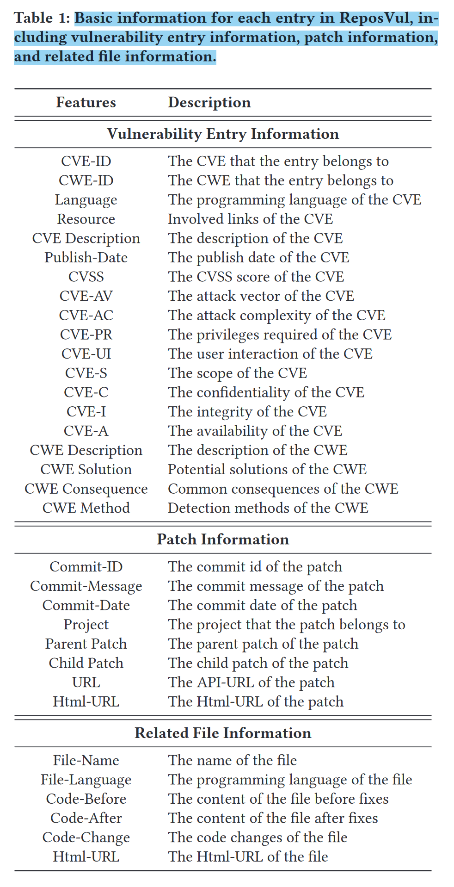

### links
* 论文链接
	* [ReposVul: A Repository-Level High-Quality Vulnerability Dataset | IEEE Conference Publication | IEEE Xplore](https://ieeexplore.ieee.org/abstract/document/10554864)

* dataset
	* [Eshe0922/ReposVul: [ICSE 2024 Industry Challenge Track] Official implementation of "ReposVul: A Repository-Level High-Quality Vulnerability Dataset".](https://github.com/Eshe0922/ReposVul)
* 论文阅读
	* [ReposVul: A Repository-Level High-Quality Vulnerability Dataset 论文阅读-CSDN博客](https://blog.csdn.net/m0_52048145/article/details/143633507)

### 摘要
过去的漏洞数据库中主要存在以下几种问题：
* 无效补丁（Tangled Patches）：针对某个漏洞的补丁无法正确修复该漏洞。开发者可能会在补丁中提交与漏洞修复无关的代码更改，导致补丁内容混乱。
* 缺乏跨函数漏洞（Inter-procedural Vulnerabilities）：现有的漏洞数据集通常包含函数级和文件级的漏洞，**忽略了函数之间的关系**，因此使得这些方法无法检测跨过程漏洞。  
* 过时补丁（Outdated Patches）：修复了该漏洞的补丁造成了全新的漏洞，导致该补丁过时  


本文通过下面的方法构建一个解决了上述问题的数据库 ReposVul。
* 一个自动化数据收集框架，并构建了第一个仓库级别的高质量漏洞数据集，名为ReposVul。
* 该框架主要包含三个模块
	* 一个漏洞解开模块，旨在区分“与漏洞修复相关的代码变更”和“无效的补丁“，其中联合使用了大语言模型（LLMs）和静态分析工具。
	* 一个多粒度依赖提取模块，旨在捕捉漏洞的跨过程调用关系，我们为每个漏洞补丁构建了多粒度的信息，包括仓库级、文件级、函数级和行级。
	* 一个基于追踪的过滤模块，旨在过滤过时的补丁，利用文件路径追踪过滤器和提交时间追踪过滤器构建一个最新的数据集。
* 仓库级ReposVul数据集规模
	* 收集到：6,134个CVE条目，代表1,491个项目中的236种CWE类型，涵盖四种编程语言。
	* 涉及：6897 个补丁的 14706 个文件，包含了 212790 个 C 语言函数，20302 个 C++ 函数，2816 个 Java 函数，26308 个 Python 函数。
	* 在 C 语言中涵盖了 149 个 CWE 类型，在 C++ 中涵盖了 105 个，在Java中涵盖了 129 个，在 Python 中涵盖了 159 个。

### Intro

* **无效的补丁**：漏洞修复补丁可能包含与漏洞修复无关的代码更改，从而导致补丁内容混乱。现有数据集[11–13]通常将一个补丁提交中的所有代码更改都视为与漏洞相关，这引入了自然的数据噪声。
* **缺乏跨过程漏洞**：现实场景中的漏洞通常涉及多个文件和函数之间的调用，而单独的函数不一定存在漏洞。现有的数据集[11, 13]主要集中在函数级别的粒度，忽略了调用信息。
* **过时的补丁**：补丁可能会引入新的漏洞并变得过时，而当前的数据集没有考虑补丁的时效性。

### 框架

本文设计的框架主要由以下四个部分所构成：原始数据获取，无效补丁判定，多粒度依赖关系分析，基于时间线的过时补丁过滤。


#### 原始数据获取

* **原始数据爬取：创建初始数据集涉及三个步骤：1) 从开源数据库爬取漏洞条目，2) 从多个平台获取与漏洞条目相关的补丁，3) 获取与补丁相关的变更文件的详细信息。**
##### Vulnerability Entry Collection
* 漏洞数据来自 **Mend 这一漏洞数据库**。
* 按时间顺序获取CVE条目，以便识别过时的补丁。
* 将这些条目以结构化的格式存储，如表1中的“漏洞条目信息”部分所示。每个条目包含了关键特征，如CVE-ID、CVE描述、相关的CWE-ID，CWE描述及其他相关信息。

##### 
* 本文分析所用的补丁则来自于 Github，还有一部分来自 Google 代码仓库 Android 和 Chrome。
* 对于一个补丁，为了更好的分析函数间的修复情况，本文主要收集它的 **commit ID、commit 信息、修改文件名以及它所修改的前后代码**。

#### 无效补丁判定（漏洞解开模块）

* 本文主要采用**大模型和静态分析工具共同分析一个补丁是否有效。**
* 对于大模型，本文使用 prompt 预设大模型是一个漏洞分析专家，提供原始代码、漏洞修复代码等让大模型回答是或否以判定该修复是否有效。
* 为了更加准确的判定该补丁是否有效，本文针对不同的语言采用了不同的静态分析工具，如 C/C++ 使用 Cppcheck、Flawfinder、RATS、Semgrep 工具检测，Python 则使用 RATS 和 Semgrep，而 Java 则仅用 Semgrep。
* 对于一个漏洞补丁是否有效，本文采用了首先对原始代码进行静态分析检测，随后将修复后的代码再次检测的方式来判定该补丁是否有效，如果同一漏洞依然存在则判定补丁无效。
* **最后将大模型和静态分析工具的检测结果进行合并，仅当二者判定均为有效或无效的时候才采用该补丁数据。**

#### 多粒度依赖关系分析（多粒度依赖提取模块）

我们**提取整个仓库中漏洞的跨过程调用关系，旨在为每个漏洞补丁构建多粒度的信息，包括文件级、函数级和行级信息。** 主要分为以下四个层次：
* 仓库级：对于每个与漏洞修复相关的文件，本文提取**整个仓库中漏洞之间的程序调用关系链。**
* 文件级：本文将代码更改前后的**与漏洞修复相关的文件**分别视为易受攻击和不易受攻击。对于**与漏洞修复无关的文件**，将代码更改前后的文件都视为不易受攻击。
* 函数级：对于每个受代码更改影响的函数，如果该函数在漏洞修复相关文件中有定义，本文将**代码更改前后的函数**分别视为易受攻击和不易受攻击；如果该函数在漏洞修复无关的文件中有定义，本文将代码更改前后的函数都视为不易受攻击。
* 行级：提取该行的修改。

对于仓库级别的函数调用树（callerTree）和函数被调用树（calleeTree），使用如下算法分析获取：对于与漏洞修复相关的文件中每个变化的代码片段，首先识别出调用树和被调用树的根函数，分别命名为 callerRoot 和 calleeRoot。随后，使用特定的静态分析工具从 callerRoot 构建调用树，从 calleeRoot 构建被调用树。对于不同的编程语言，我们使用不同的工具：C/C++ 使用 CFlow，Java-all-call-graph 用于Java，Python 则使用 PyCG。

#### 基于时间线的过时补丁过滤（基于追踪的过滤模块）

我们首先基于文件路径和提交时间追踪补丁的提交历史。通过分析补丁的历史信息，我们随后通过追踪提交差异来识别过时的补丁。

本文首先将所有的 commit 过滤，清除掉对数据、日志文件或者说明文件的修改提交，**仅关注某一单一文件的修改历史，对比最新当前版本和修改后的补丁是否一致，仅保留修改后和当前最新版本一致的补丁。**

### 数据分析

本文的数据集相较于其他的漏洞数据集有如下的优点：
* 多粒度信息：与其他仅包含线级、函数级和文件级漏洞的数据集相比，ReposVul 包含了更全面的粒度，包括仓库级、文件级、函数级和线级漏洞，考虑了跨程序漏洞，并提供了比单一补丁更多的信息。ReposVul 包含了来自 6897 个补丁的 14706 个文件，包含了 212790 个 C 语言函数，20302 个 C++ 函数，2816 个 Java 函数，26308 个 Python 函数。
* 广泛的 CWE 覆盖：ReposVul 涵盖了比所有其他数据集更多的 CWE 类型。ReposVul 在 C 语言中涵盖了 149 个 CWE 类型，在 C++ 中涵盖了 105 个，在Java中涵盖了 129 个，在 Python 中涵盖了 159 个。ReposVul 涵盖了跨越各种编程语言的 CWE 类型，因为一些 CWE 类型不是特定于语言的。这表明 ReposVul 提供的数据比现有的基准测试更为全面。
* 有效的标记方法：之前的工作通过当前的标记方法识别了现有数据集中的噪声数据问题。在本文中，ReposVul 提出了一个用于提高漏洞数据质量的漏洞解绑模块。它涉及静态分析工具中的漏洞规则和领域知识以及 LLMs 的强上下文理解能力。
* 识别过时的补丁：当前的漏洞数据集无法区分过时的补丁。ReposVul采用基于轨迹的过滤模块来识别潜在的过时补丁。基于轨迹的过滤模块整合了基于文件路径的过滤器和基于提交时间的过滤器，以提供过时补丁的标签。
* 额外信息的特定丰富性：**ReposVul 包含最丰富的额外信息，包括 CVE 描述、CVSS 和补丁提交历史，以及静态分析信息。** 关于漏洞的全面信息使开发者和研究人员能够采取有效的措施进行漏洞检测。
* 标签更为准确：在最先进的开源软件（OSS）漏洞数据集中，20-71% 的漏洞标签是不准确的。ReposVul 在 C、C++、Java 和 Python 上的标签准确率分别为 85%、90%、85% 和 80%。与现有OSS漏洞数据集相比，ReposVul实现了相对更高的准确率。在四种编程语言中，特别是 C++ 编程语言，其准确率高达 90%。我们的观察表明，由于大模型的上下文理解能力和静态分析工具的领域知识的整合，ReposVul 的标签质量优于以前的数据集。

本文还就不同大模型的漏洞识别能力进行了对比，结果如下：  
  
  

本文的数据集在如下两个方面还可改进：  
* 数据来源丰富度不足：在收集过程中，本文从 GitHub、Google Git 和 bugs.chromium 收集 ReposVul，这导致了一些在ReposVul 中托管在其他平台上的项目被遗漏。  
* 编程语言种类不够丰富：本文只提取了四种广泛使用的编程语言的仓库级依赖。然而，其他语言也存在漏洞，例如 JavaScript、Go 和 PHP。  
* 漏洞时间跨度不够长：本文只从 2010 年开始收集 CVE 漏洞，之前的 CVE 漏洞没有包含在 ReposVul 中，这导致一些漏洞可能在之前几年被发现并修复。

### ReposVul 数据集结构
#### 元数据规模
* c：所有cwe类型包含4010条cve。
	* 下面是buffer overflow类型的相关cwe的cve数量。
		* CWE-119:549
		* CWE-120:85
		* CWE-121:12
		* CWE-122:71
		* CWE-124:1
		* CWE-131:2
		* CWE-680:6
		* CWE-787:365
		* CWE-805:2
	* 下面是double free类型的相关cwe的cve数量。
		* CWE-415:64
* cpp：所有cwe类型包含689条cve。
	* 下面是buffer overflow类型的相关cwe的cve数量。
		* CWE-119:49
		* CWE-120:17
		* CWE-121:0
		* CWE-122:10
		* CWE-124:1
		* CWE-131:1
		* CWE-680:0
		* CWE-787:100
		* CWE-805:0
	* 下面是double free类型的相关cwe的cve数量。
		* CWE-415:4
#### note
此处展示我自己收集的Android相关的bo和df的cwe数目，如下：
* BufferOverflow最终爬取数量：382
* BufferOverflow分类(C相关/总数)：
	* CWE-119(117/137)
	* CWE-120(10/16)
	* CWE-122(4/4)
	* CWE-131(1/3)
	* CWE-787(250/290)
* DoubleFree最终爬取数量：15
* DoubleFree分类：
	* CWE-415(15/17)

**各类cwe的cve数目相对大小基本一致，buffer overflow较多的为CWE-119, （CWE-120, CWE-122,） CWE-787**

该数据集中的bo和df的cwe集，与我之前收集的android相关的bo和df的cwe集，几乎没有重合。（论文提到，其数据集也从android补丁官网进行了收集，但是这边的重合却很少）
* CWE-119: 0/117
* CWE-120: 0/10
* CWE-122: 0/4
* CWE-131: 0/1
* CWE-787: 4/250
* CWE-415: 0/15
#### 元数据属性
对于每个漏洞，包含如下属性：
* 标注了漏洞编号 `CVE_id`，漏洞基本信息如代码语言 `CVE_language`、危险级别 `CVSS`、所属项目 `project` 等。
* 该漏洞修复的完整 commit 历史记录 `commit_id` 和 `parents` 数组，以及在 `details` 字段包含大模型和静态分析对该漏洞的修复情况判断（`details` 属性的 `llm_check` 字段和 `static` 数组展示了每种静态工具的检测结果），修改的完整代码文件 `code`、修复前后比对记录 `patch` 属性。

```
.
+-- index:integer
+-- cve_id:string,The CVE that the entry belongs to
+-- cwe_id:list of string,The CWE that the entry belongs to
+-- cve_language:string, The programming language of the CVE
+-- cve_description:string,The description of the CVE
+-- cvss:string,The CVSS score of the CVE
+-- publish_date:string,The publish date of the CVE
+-- AV:string,The attack vector of the CVE
+-- AC:string,The attack complexity of the CVE
+-- PR:string,The privileges required of the CVE
+-- UI:string,The user interaction of the CVE
+-- S:The scope of the CVE
+-- C:string,The confidentiality of the CVE
+-- I:string,The integrity of the CVE
+-- A:string,The integrity of the CVE
+-- commit_id:string,The commit id of the patch(一般是url和html_url的后缀)
+-- commit_message:string,The commit message of the patch
+-- commit_date:string,The commit date of the patch
+-- project:string,The project that the patch belongs to
+-- url:string,The API-URL of the patch
+-- html_url:string,The Html-URL of the patch
+-- outdated:integer(boolen),补丁是否过时？？？
+-- cwe_description:string,The description of the CWE,数据集对于这个键都是空的。这边按道理应该也是list of string，对应上面的cwe_id列表中的所有cwe。
+-- cwe_consequence:string,Common consequences of the CWE。同cwe_description。
+-- cwe_method:string,Detection methods of the CWE。同cwe_description。
+-- cwe_solution:string,Potential solutions of the CWE。同cwe_description。
+-- details
|   +-- raw_url
|   +-- code
|   +-- code_before
|   +-- patch
|   +-- file_path
|   +-- file_language
|   +-- file_name
|   +-- outdated_file_modify
|   +-- outdated_file_before
|   +-- outdated_file_after
|   +-- llm_check
|   +-- static_check
|   +-- static
    |   +-- flawfinder
    |   +-- rats
    |   +-- semgrep
    |   +-- cppcheck
|   +-- target
|   +-- function_before
    |   +-- function
    |   +-- target
|   +-- function_after
    |   +-- function
    |   +-- target
+-- windows_before
|   +-- commit_id:string,The commit id of the patch。替换为html_url的后缀，即可得到对应的html_url。
|   +-- commit_date:string,The commit date of the patch
|   +-- commit_message:string,The commit message of the patch
|   +-- files_name
+-- windows_after
|   +-- commit_id
|   +-- commit_date
|   +-- commit_message
|   +-- files_name
+-- parents
|   +-- commit_id_before
|   +-- url_before
|   +-- html_url_before
```

